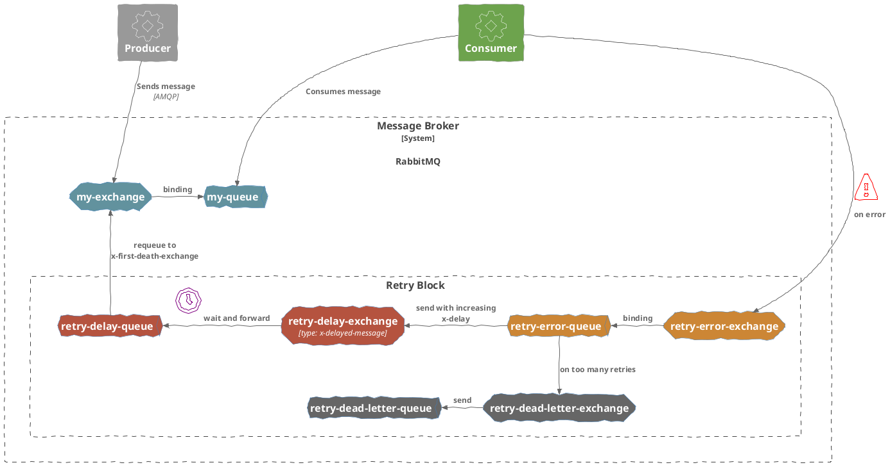

I have finally implemented a solution to automatic retries for
a RabbitMQ message queue.
I have pointed out the problem of retrying failed messages with a delay in a
[previous post]().

I am still sad there is no ready-to-use solution and you have to write code yourself
to make this work, but well. At least it is a solution.

You can find an example project in python here:
[https://github.com/andreas-mausch/rabbitmq-with-retry-and-delay](https://github.com/andreas-mausch/rabbitmq-with-retry-and-delay)

The concept is heavily inspired by
[https://devcorner.digitalpress.blog/rabbitmq-retries-the-new-full-story/](https://devcorner.digitalpress.blog/rabbitmq-retries-the-new-full-story/).

# Breakdown

So we have a bunch of extra exchanges and queues for this approach.

The main difference to Cyril's solution is that we don't re-send the message to a queue directly,
but rather to it's original exchange with it's routing key.

One good thing though is: We can use this retry-block for as my queues as we like.
It doesn't have to be repeated for each queue. Phew.

So we can set up a number of retries in our code, each having a delay time.
When a message still couldn't be delivered after the last delay, it
is finally sent to the `retry-dead-letter-exchange`.
There, an admin can look regulary which messages had problems to be consumed.

In the example code the retry delays are:

- 5 seconds
- 2 minutes
- 30 minutes
- 6 hours
- 2 days

My example also covers the case of having a quorum queue, and here it is a bit disappointing:
Even though you can still use the retry mechanism via `x-delivery-limit`, the retries will
still be **immediate**.
If you want to have increasing delay here as well, you must skip the automatic quorum queue
mechanism by setting `requeue=False` in case of an error, so the dead-letter-exchange
(`retry-error-exchange`) will be used instead.



# Why do we need a delay exchange?

First, I was surprised we need that second exchange in the retry-block.
Why not just have a single one?

The reason is: In order for `x-delay` to work, we need an exchange of the type `x-delayed-message`.
So we have the choice of either making our normal exchanges all of this type, or
rather have only a single place for this exception.

And the `retry-error-exchange` cannot be the exchange to be `x-delay-message`, because
at this point the message doesn't have the `x-delay` header yet.

# Error handling

So we have covered the case something goes wrong inside our consumer.

In case there is a problem in the consumers of the `retry-error-queue` or the `retry-delay-queue` themselves,
we define a dead letter exchange for them as well, and it is also the `retry-dead-letter-exchange`.

Now we keep all non-consumable messages for analysis:
even if all retries failed and even if there was a processing problem inside
the retry handlers.

# RabbitMQ Delay Plugin

One more downside to this solution:
We cannot just use the basic RabbitMQ docker image anymore, because we need to have
the [delayed-message-exchange](https://github.com/rabbitmq/rabbitmq-delayed-message-exchange/) enabled.

See [Scheduling Messages with RabbitMQ](https://www.rabbitmq.com/blog/2015/04/16/scheduling-messages-with-rabbitmq).

I use `heidiks/rabbitmq-delayed-message-exchange:3.13.3-management` for now, but we'll
see how well this is maintained over time.
